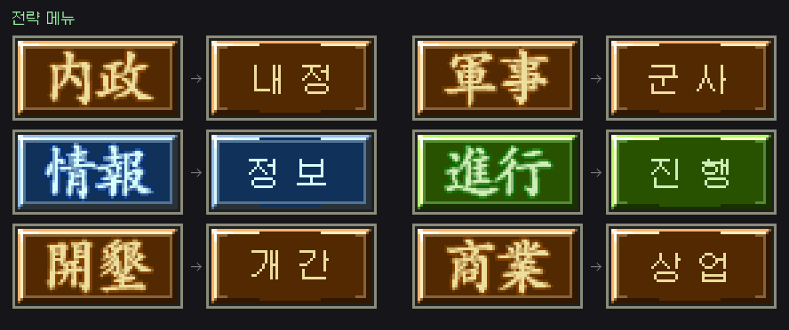
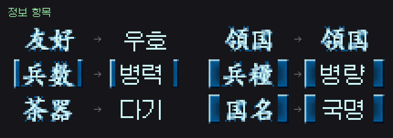
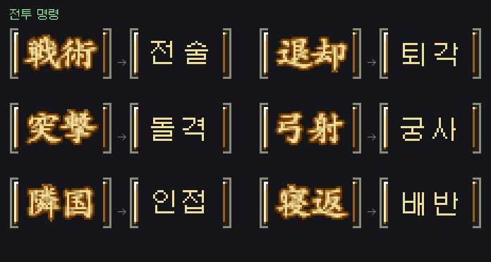
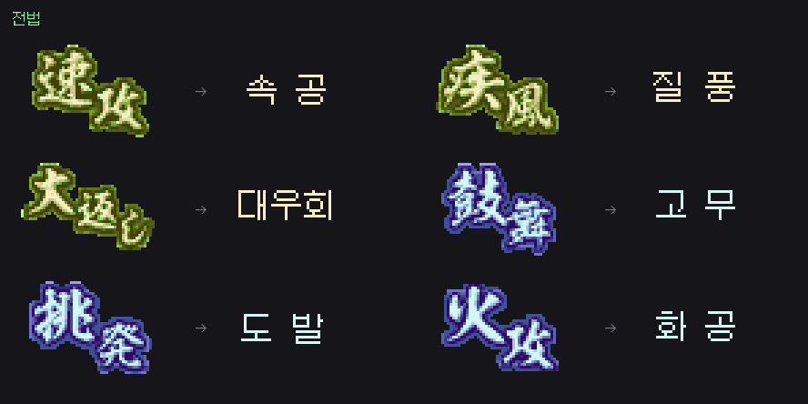
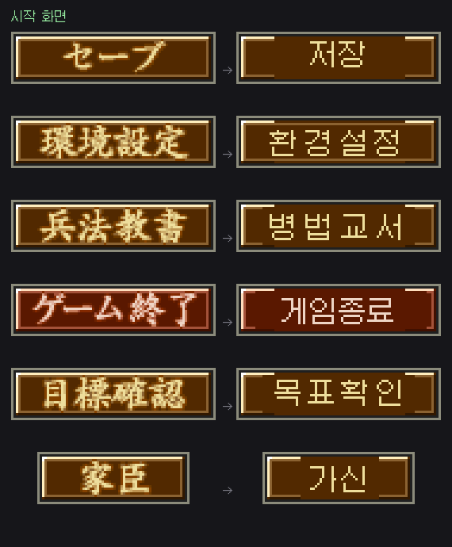
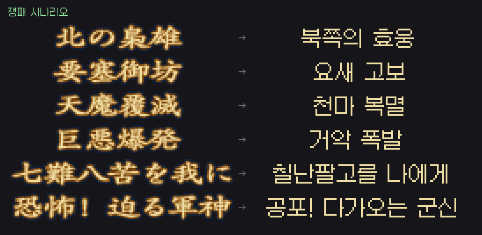

# 노부나가의 야망 DS 2 한글패치 (Nobunaga no Yabou DS 2 Korean Patch)

코에이 **노부나가의 야망 DS 2** (信長の野望DS 2, 2008, CN2J)의 비공식 한글화 패치입니다.

## 특징

- 게임 내 12×12 비트맵 폰트를 **갈무리11**(Galmuri) 한글 폰트로 교체
- 대사·이벤트·메뉴 설명·튜토리얼·무장 열전 등 msgsec 텍스트 전체 번역 (약 10,000 유닛 / 원문 267KB)
- 무장/지명/성/가보/스킬 이름 데이터베이스(common.snr) 음역 및 번역
- ARM9 내장 시스템 메시지 번역
- **v1.3**: msgsec 파일을 게임의 메시지 버퍼 한계(원본 최대 16,137B) 이내로 확장해
  번역을 축약 없이 자연스러운 문장으로 복원
- **v1.4**: 스프라이트 이미지로 구워진 메뉴 버튼 라벨 329개를 한글로 다시 그림
  (NCER 셀 리버싱 + 자동 글자영역 검출 + 갈무리 폰트 렌더링)
- **v1.5**: 무장 데이터베이스의 이진 필드(얼굴 번호 등)가 손상되던 중대 버그 수정,
  메뉴 라벨 글자 크기 확대
- **v1.6**: 축약 정책을 반전(가장 좋아진 번역부터 되돌리던 문제 수정) +
  줄 끝 여백 회수로 대사 확장 폭 확대
- **v1.7~v1.8**: 상한 때문에 축약이 불가피한 자리도 전보체 대신
  같은 예산의 자연스러운 문장으로 교체 (1,332문장, 전보체 잔량 188개로 수렴)
- **v1.9 / v1.9.1**: 게임 내 스프라이트 이미지 2,276장을 전수 추출·판독해 일본어가 들어간
  것을 선별하고, 19개 파일 **662셀**의 글자를 갈무리11 12pt로 다시 그림.
  전략 메뉴(내정·군사·인사·대외·정보·진행), 전투 명령(전술·돌격·철포·궁사),
  전법 이름(속공·질풍·간파), 쟁패 시나리오 제목, 저장/환경설정 화면 등.
  변경 결과는 `images/`에 **변경 전·후 비교 PNG**로 모두 첨부했습니다.

## 적용 방법

1. 본인이 소유한 **일본판 ROM**을 준비합니다.
   - 파일명 예: `Nobunaga no Yabou DS 2 (Japan).nds`
   - 원본 CRC32: `72C536BA` / 패치 후 CRC32(v1.9.1): `56CBDC0F`
2. xdelta 패치 적용 도구를 사용해 `nobu2-kr.xdelta`를 적용합니다.
   - Windows: xdeltaUI 또는 [xdelta3](https://github.com/jmacd/xdelta) 명령행:
     ```
     xdelta3 -d -s "원본.nds" nobu2-kr.xdelta "한글판.nds"
     ```
   - 웹: [RomPatcher.js](https://www.marcrobledo.com/RomPatcher.js/) (xdelta 지원)
3. 생성된 ROM을 melonDS / DeSmuME 등 에뮬레이터 또는 실기에서 구동합니다.

## 변경된 이미지 확인

### 대표 컷

| 전략 메뉴 | 정보 항목 |
|---|---|
|  |  |

| 전투 명령 | 전법 |
|---|---|
|  |  |

| 시작 화면 | 쟁패 시나리오 |
|---|---|
|  |  |

### 전수 비교 시트

`images/sheets/`에 패치된 19개 그래픽 파일의 **변경 전(BEFORE) / 후(AFTER) 비교 시트**가
모두 들어 있습니다. 파일명은 `<원본파일>_<시트번호>.png`이며, 각 행 왼쪽이 원본,
오른쪽이 한글화 결과입니다. `images/index.json`에 파일별 변경 셀 수가 있습니다.

## 알려진 제한 사항

- **타이틀 화면과 스태프롤(Ending)** 은 일본어로 남아 있습니다.
  스태프롤은 역할·이름 2행 블록 구조라 단일행 레이아웃으로 재현할 수 없어 제외했습니다.
- **일러스트에 캡션이 얹힌 그래픽**(무장 작성 아이콘, 계절 엠블럼, 통신 로고 등
  `C256_*` 계열)과 `Common`·`ComTutor`·`SaveLoadShita`는 제외했습니다.
  글자 영역과 그림을 분리할 수 없어 손대면 그림이 망가집니다.
- 아래 경우의 셀도 안전을 위해 원문을 유지합니다(자동 검증에서 걸러짐).
  - 서로 다른 문구가 **같은 타일**을 공유해 한쪽을 고치면 다른 쪽이 깨지는 경우
    (예: 세이브 화면의 `データがありません` / `プレイ時間`)
  - 검출된 글자 영역이 한글 폭에 비해 지나치게 넓거나 좁은 경우
  - 한글이 원문보다 1.5배 넘게 넓어 버튼에 넣으면 눌리는 경우
  - 애니메이션 중간 프레임이라 글자 영역이 잘려 있는 경우
- 신무장 작성 시 한자 입력기는 한글 음절 선택기로 동작합니다(폰트 교체의 부수 효과).
- 일부 바이트 예산이 극히 작은 조사(1바이트)는 공백으로 처리되어 문장이 살짝 축약될 수 있습니다.
- Wi-Fi(WFC) 관련 화면은 서비스 종료로 검증되지 않았습니다.

## 기술 정보

- 폰트: ARM9 내장 12×12 1bpp 연속 패킹 폰트(3,574 글리프), SJIS→글리프 룩업 테이블 리버싱
- 한글 인코딩: 한자 글리프 슬롯(3,200여 개)에 사용 음절을 동적 할당하는 방식
- 그래픽 라벨: NCLR/NCGR/NCER 파서로 셀을 복원(mappingMode 2 = 타일 경계 4).
  UI 문자는 **글리프 아틀라스**라 `確定`과 `確認`이 `確` 타일을 공유하므로,
  문자열 단위가 아니라 **글자 단위**로 같은 칸에 그려 공유 글리프가 항상 같은 음절을
  받도록 했습니다(한자음 1:1). 서로 다른 글자가 같은 픽셀을 요구하면 그 라벨은 건너뜁니다.
  갈무리11은 픽셀 폰트라 안티에일리어싱을 끄고 12/24px에서만 렌더링합니다.
- 손상 자동 검출: 패처가 셀마다 **수정을 허용한 사각형**을 기록하고
  (`tools/gfx/check_damage.py`) 그 밖에서 바뀐 픽셀을 전수 집계합니다.
  스프라이트가 타일을 공유하는 구조라 한 라벨의 쓰기가 엉뚱한 셀에 구멍을 내는 것이
  결함의 본질이었고, 이 계측을 기준으로 규칙을 좁혔습니다.
- 자세한 기술 문서와 도구는 `tools/` 참조

## 라이선스 / 고지

- 이 저장소는 **패치 파일과 도구만** 포함하며 게임 데이터(ROM)는 포함하지 않습니다.
- 게임 저작권은 KOEI(現 코에이테크모)에 있습니다. 패치 적용은 본인 소유 사본에만 하십시오.
- 한글 폰트: [Galmuri](https://github.com/quiple/galmuri) (SIL OFL 1.1)
- 번역·패치 도구: Claude (Anthropic) 협업으로 제작
